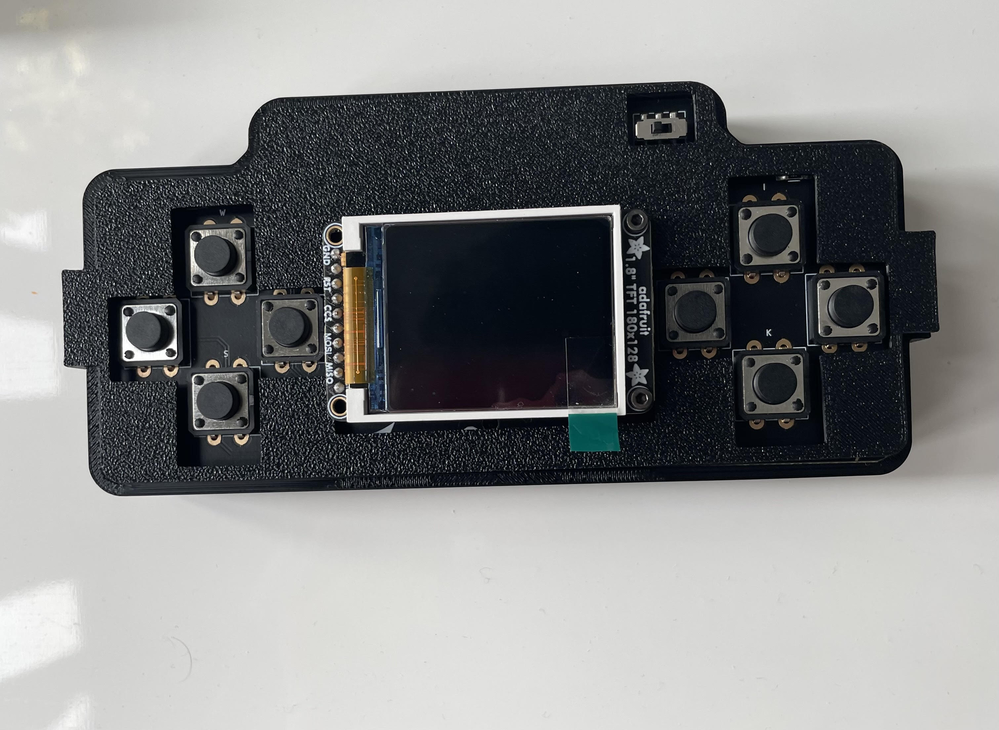

# sprig_case
a 3d printed case for the sprig you can print yourself!

# Versions
You have 2 different versions of the sprig case, one being being the orginal case that takes less filament and is more lightweight with the other being made by a amazing contributor, Ben Park. This version of the case is alot more like a handheld video game console and uses a bit more filament. Ultimatly it comes down to what you like the look of more.  
# Printing
In most use cases you will want to head to makerworld and directly print it [here](https://github.com/DragonRoyal/sprig_case) with all presets already chosen but you can also download the 3mf files and download from that.
**Supports should be enabled**.

# Assembly
Once everything has finished printing you can use pliers to remove the support material but it is not needed to, inser your sprig in the case and attach the top cover.

Your sprig case should be ready to work!
